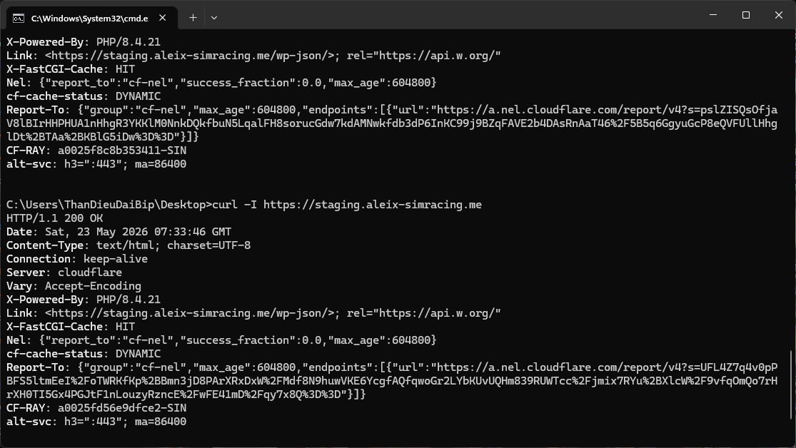
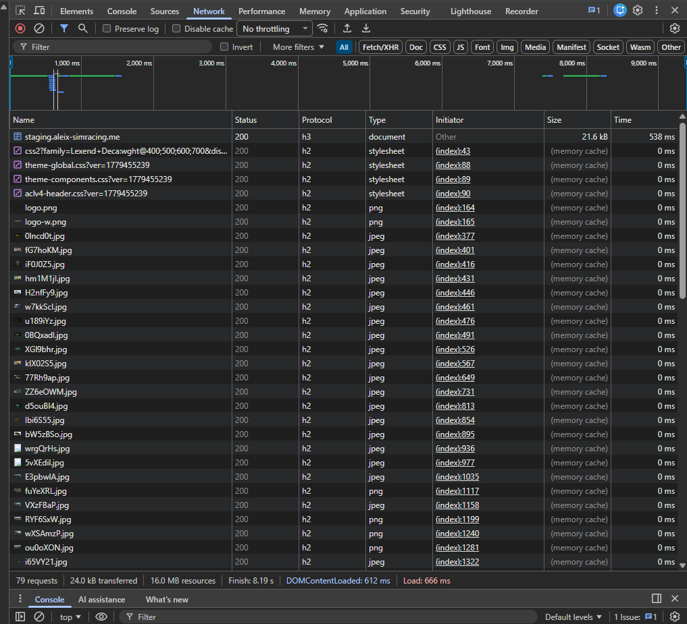

# 🔧 Content Distribution Platform Infrastructure: Staging & Load Test Environment

**Sub-environments & Architecture Validation Branch**

This branch serves as an isolated Staging environment to validate and test the new open-source infrastructure upgrade (**NGINX, Redis, PHP-FPM, Docker, and GitHub Actions CI/CD**). 

The primary objective of this branch is to ensure that the new NGINX FastCGI caching architecture runs seamlessly with the existing production WordPress source code without application-layer crashes. This environment allows executing stress tests to guarantee the system maintains equivalent web performance and handles heavy concurrent traffic spikes safely before any production migration occurs.


## ⚡ 1. Staging Context & Technical Constraints

This environment clones the exact data structure and unoptimized code of the live website, allowing real-world load testing on a strict resource boundary.

### 📊 Staging Infrastructure & Target Benchmark Specs


| Metric | Staging Target Value |
| :--- | :--- |
| **Platform** | WordPress (Custom Theme / AI-Assisted Development) |
| **Server Hardware** | **1 vCPU / 2GB RAM** Dedicated VPS |
| **Test Host Domain** | `staging.aleix-simracing.me` |
| **Baseline Target** | **500 Max VUs (Concurrent Users)** Stress Test via k6 |
| **SSL Verification** | Let's Encrypt via containerized **Certbot Sidecar** |
| **Storage Solution** | Static assets offloaded to **Imgur** / proxied via **Cloudflare CDN** |

---

### 🚨 The Technical Problem: Cache Stampede & Database Connection Stacking
The database contains over **2,000+ posts** packed with heavy **ACF (Advanced Custom Fields)** metadata. User behavior is heavy: users frequently open multiple categories at once, open 10 to 20 tabs simultaneously, and trigger a massive amount of **AJAX queries for filtering and searching**.

During initial stress testing with a 500 Virtual Users (VUs) peak load, the baseline unoptimized stack suffered from severe database connection stacking and Cache Stampede. Un-cached search queries dived straight into PHP-FPM and MariaDB simultaneously, saturating the single core CPU at 100% and causing extreme latency timeouts. 

To resolve this bottleneck without scaling up the hardware budget, I implemented hard memory bounding and NGINX frontline micro-caching architecture inside this repository.

---

## 🏗️ 2. System Design & Architecture Blueprint

### 2.1 Hardware Resource Hardening (2GB RAM Limit)
* **MariaDB Container:** Hard-capped at `1GB RAM` via Docker Compose deployment limits to maximize SQL buffer pool while protecting the host.
* **PHP-FPM Dynamic Pool:** Capped at `pm.max_children = 4`. Each active worker consumes ~150MB under load, safely maxing out the PHP pool at 600MB.
* **Leak Recycler (`pm.max_requests = 500`):** Automatically recycles PHP workers after 500 requests to clear runtime memory leaks.
* **Timeout Window (`max_execution_time = 3600s`):** Configured to prevent crashes during heavy migration and database sync phases, ensuring the PHP-FPM process doesn't drop during long query executions.
* **Redis Object Cache:** Deployed as an in-memory data store wrapper for the database layer to offload persistent, redundant SQL query hits from WordPress core natively.

### 2.2 Security, Network Isolation & Layered Caching
* **Public Zone (`wp_frontend`):** Only the NGINX container is connected here, exposing public ports `80/443`.
* **NGINX FastCGI Microcaching:** Configured directly at the NGINX edge layer to cache dynamic PHP pages into RAM for 1-5 minutes, intercepting high-volume traffic before they trigger PHP-FPM or MySQL execution.
* **Cache Lock Engine (`fastcgi_cache_lock on;`):** Prevents Cache Stampede. When a cache miss occurs under high concurrency, NGINX passes exactly **one** worker request to PHP-FPM to rebuild the cache file, holding back the remaining concurrent requests in a safe internal queue.
* **Background Stale Delivery (`fastcgi_cache_background_update on;`):** Delivers expired cached pages instantly to users while NGINX updates the backend cache asynchronously, dropping response latency.
* **Isolated Zone (`wp_backend` / `internal: true`):** MariaDB, Redis, and PHP-FPM containers communicate exclusively inside this private internal network, completely invisible to the public internet to block automated port scans.

### 2.3 Deployment & Data Migration
1. **Infrastructure Scaffolding:** GitHub Actions only deploys the clean infrastructure framework using official `wordpress:fpm` images.
2. **Dynamic SSL Bootstrap:** A temporary **Certbot sidecar** maps ACME challenges into `/var/www/certbot` on Port 80 to securely fetch Let's Encrypt certificates directly inside the staging server.
3. **Secrets Management:** Environment variables are injected into runtime memory via a secure `.env` file.
4. **Data Restoration:** The actual heavy production data (Database, Themes, Plugins) is restored seamlessly using the **UpdraftPlus** engine directly from the WP Admin dashboard.

---

## 📊 3. Performance Metrics & Proof of Evidence

The benchmarks below isolate the performance difference of the optimized stack when running under a 500 Max VUs load test, comparing a direct NGINX hitting baseline against an NGINX + Cloudflare Proxy architecture.

### 📉 3.1 Grafana k6 Benchmarks

#### Phase 1: Direct NGINX Origin Benchmarking (Cloudflare Proxy OFF)
When hitting the NGINX origin container directly under a 500 VU stress spike, the stack maintained a **99.96% success rate (3,154 / 3,155 requests passed)** with only 1 failed request. However, hardware constraints (1vCPU) forced a long processing queue, resulting in an elevated response latency profile:

```text
http_req_duration..............: avg=3.43s   min=282.79ms med=2.99s  max=1m0s p(95)=8.24s
http_req_failed................: 0.03%       1 out of 3155
http_reqs......................: 3155        36.739/s
```

#### Phase 2: Edge-Cached Production Benchmarking (Cloudflare Proxy ON)
After routing the traffic through the Cloudflare proxy and combining edge caching with NGINX's internal FastCGI cache locks, system throughput expanded drastically. The stack achieved a **100.00% absolute success rate (8,109 / 8,109 requests passed)**, throughput tripled to **131.39 requests/s**, and the p(95) response latency dropped sharply to **1.38 seconds**:

```text
http_req_duration..............: avg=731.12ms min=280.7ms med=665.05ms max=4.06s p(95)=1.38s
http_req_failed................: 0.00%        0 out of 8109
http_reqs......................: 8109         131.395/s
```

### 📈 3.2 Real-time Infrastructure & Protocol Validation

#### Live NGINX FastCGI Cache Verification (Curl Header)
Running a direct header check confirms that the NGINX container is successfully executing the micro-caching rules under the modern **PHP 8.4** runtime environment, securely nhả **FastCGI-Cache: HIT** and offloading the backend server during concurrency.

```text
HTTP/1.1 200 OK
Server: cloudflare
X-Powered-By: PHP/8.4.21
X-FastCGI-Cache: HIT
cf-cache-status: DYNAMIC
```


#### Browser Network Layer Validation (HTTP/3 and Sub-550ms Response)
Live browser network logs verify that the staging host successfully runs over the next-gen **HTTP/3 (h3)** protocol. The document request achieves a crisp **538ms response time** under load, while all persistent static assets load instantly at **0ms via browser Memory Cache**, reducing server-side disk I/O load.

```text
Domain: staging.aleix-simracing.me
Protocol: h3 (HTTP/3 over QUIC)
Document Response: 21.6 kB / 538 ms
Static Assets Overhead: 0 ms (100% Memory Cached)
```

