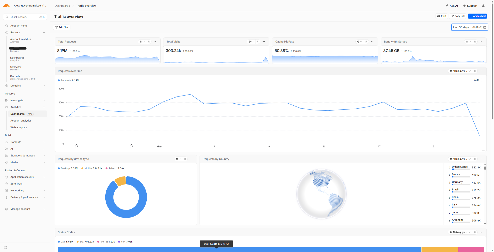
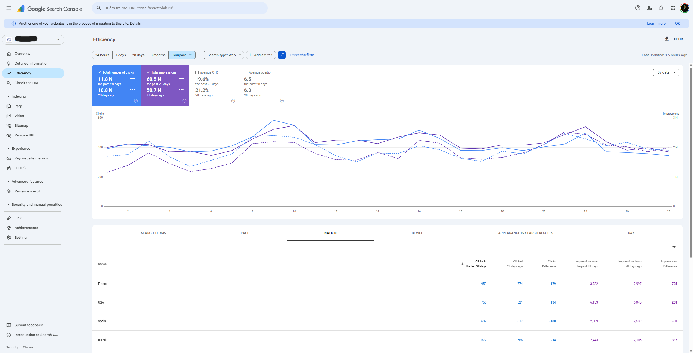
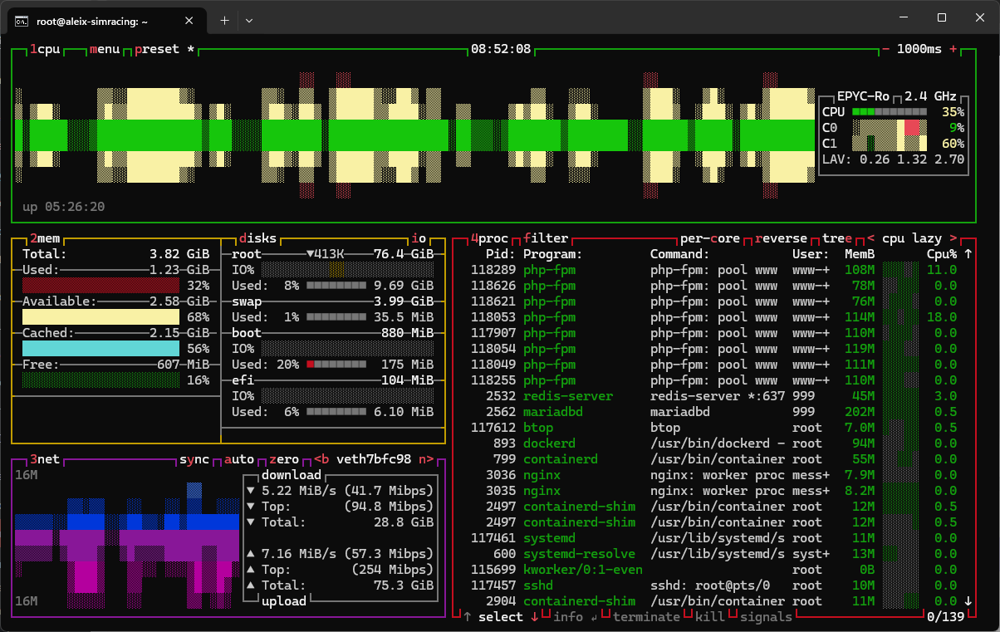
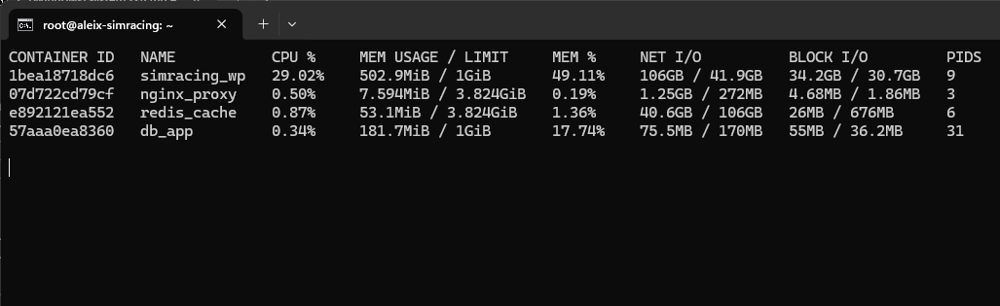
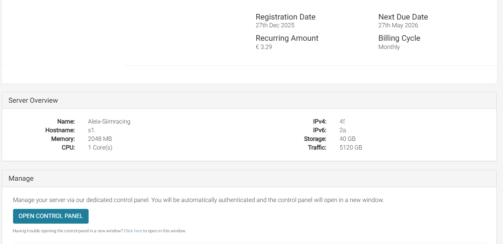
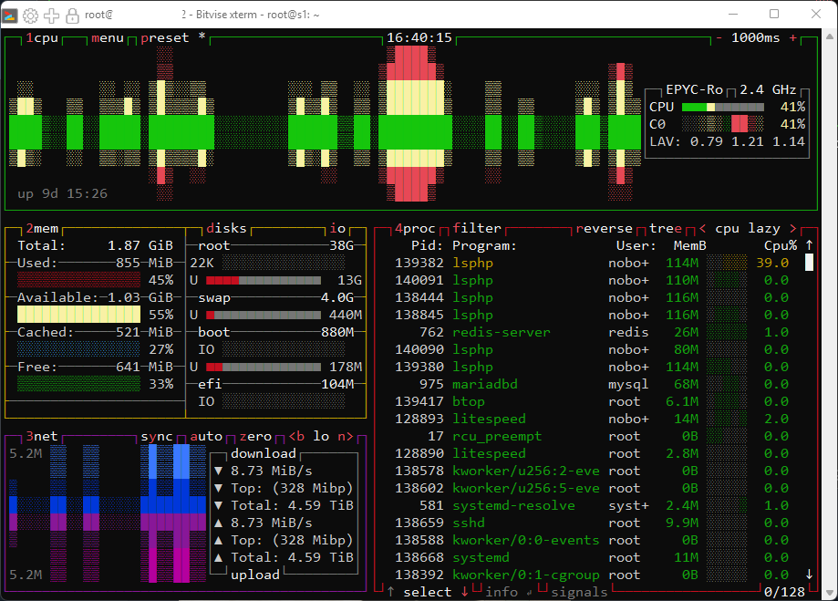

# 🔧 Content Distribution Platform Infrastructure: ~5K Sessions on a €5.8 VPS

**🪵 So... What's Up With This Repo?**

This repository contains the production-ready infrastructure blueprint (**NGINX, Redis, PHP-FPM, Docker, and GitHub Actions CI/CD**) that powers my live commercial website today. 

It is the direct architectural upgrade of my previous lab project: [WordPress on Docker: 5,000 Client Benchmark on 1GB RAM VPS (v2.0)](https://github.com/aleixnguyen-vn/docker-wordpress-performance). While version 2.0 was a cool lab experiment using Caddy, it suffered from a classic junior trap: **Overengineering**. After a year of running actual production traffic and optimizing infrastructure costs out of my own pocket, I rebuilt the entire stack for maximum resource efficiency.

## ⚡ 1. Live Production Context & Technical Constraints

This infrastructure holds together a live, high-traffic, database-heavy community catalog platform serving the global simracing community for **Assetto Corsa** (and yes, I am a Sim-Racer too 🦅). 

### 📊 Production & Financial Metrics

| Metric | Live Value |
| :--- | :--- |
| **Platform** | WordPress (Custom Theme / AI-Assisted Development) |
| **Server Specs** | **2 vCPU / 4GB RAM** Dedicated VPS (Upgraded) |
| **Infrastructure Cost** | **€5.78 / month** |
| **Live Traffic** | **4,000 - 5,000 Daily Sessions** (>7,000 daily visits) |
| **SEO Performance** | **62K Impressions / 12K Clicks** (Average month on Search Console) |
| **Financial Output** | **~$350 USD MRR** (Monthly Recurring Revenue) |
| **Storage Solution** | Images offloaded to **Imgur** + **Cloudflare CDN/Proxy** |

---

### 🚨 The DB Bottleneck & Structural Challenges

The website is a community catalog platform with over **2,000+ posts** packed with complex **ACF (Advanced Custom Fields)** metadata. User behavior is aggressive: 
* **The Access Pattern:** Users frequently open a single category, execute search queries, and then middle-click to open 10–20 tabs simultaneously.
* **The System Shock:** This browsing behavior triggers a massive storm of continuous **AJAX queries for dynamic filtering and searching**, putting the MySQL database under constant heavy fire. Standard shared hosting environments collapsed instantly within the first week of deployment.
* **The Application State:** To be honest, the database queries are unoptimized. Historically, under LiteSpeed Enterprise's native core caching module, the server remained fully functional despite the messy codebase. The operational principle back then was pragmatic: if the system remains profitable and users do not complain, application code refactoring is unnecessary. 🤌

---

### 💸 The Financial Trap: The Licensing Roadblock

Why not just upgrade the VPS hardware configuration under the old webserver setup to fix the slow queries? Because of a software **License Bottleneck**. 

The server previously ran **LiteSpeed WebServer Enterprise** under a *Free Starter License*—an excellent setup for local caching, but one that strictly caps hardware usage at 1 vCPU, 2GB RAM, and 1 domain only.

This created a severe gọng kìm operational bottleneck:
* **The License Trap:** Upgrading the host hardware under LiteSpeed forced a mandatory shift to a paid proprietary software license tier costing **$10/month** or more. Spending an extra $10/month for a $350 MRR project yields zero business value, as it generates no extra traffic or revenue growth.
* **The Hardware Trap:** Simply keeping the old 1 vCPU / 2GB RAM spec while switching to open-source NGINX was also impossible. Production testing proved that while a 1C/2GB container stack works fine in an isolated staging lab, a single-core CPU completely freezes and hits a massive processing queue under real production traffic.

**The Solution:**
To break free from this license lock and hardware limitation, migrating to this 100% free, open-source Dockerized NGINX stack was the only logical path. By removing the proprietary licensing fees, the budget was reallocated to upgrade the raw computing hardware to **2 vCPU / 4GB RAM (€5.78/month total)**. Spending an extra €2.49/month on raw hardware specs is infinitely more efficient than paying for web server licenses, giving the infrastructure genuine multi-threaded capacity to process real-world concurrent query floods smoothly.

### 🛡️ System Evolution & Survival Timeline

The platform has been running stably for over a year through 3 major architectural upgrade stages:
* **v1.0 (The Origin):** Started as a simple static site built with **Hugo** and hosted on **GitHub Pages**. As content exploded, Hugo became impossible to scale for a complex content database.
* **v2.0 (The Migration):** Executed a data data migration of **1,000+ posts** to WordPress. To maintain design consistency and prevent confusing regular users, a custom theme cloning the old Hugo layout was built with heavy AI assistance. Check the workflow: 🫴 [Hugo to WordPress Migration](https://github.com/aleixnguyen-vn/hugo-to-wordpress-migration/)
* **v3.0 (The Present):** Rewrote the theme frontend to remove redundant AJAX/ACF queries, lowering base server load.

During this 1-year journey, the infrastructure successfully survived competitor sabotage, heavy DDoS attacks, a domain-loss crisis, and a complete VPS wipeout. The local stack (**LiteSpeed Enterprise + LiteSpeed Cache + LS-PHP + Redis Object Cache + Cloudflare Edge**) kept the database from hitting OOM faults. 

However, because the hardware configuration was permanently locked at the 2GB RAM limit due to the license restriction, migrating to a free, open-source solution that can scale horizontally without licensing fees became mandatory.

## 🏗️ 2. System Design & Architecture Blueprint

### 💡 Caching Strategy Pivot: Staging vs. Real-World Production

During initial `staging` branch testing, **NGINX FastCGI Cache** performed perfectly under synthetic k6 benchmarks because traffic only hit pre-cached static pages on an isolated server. However, live production deployment with active users exposed severe architectural conflicts:

* **The Container Isolation Issue:** Forcing low-level FastCGI caching inside isolated Docker boundaries broke core WordPress logic. It triggered persistent session drops, cookie authentication bypasses, directory/file permission mismatches, and fatal white-screen errors.
* **The Time-Box Limit:** After 2 to 3 hours of troubleshooting custom NGINX bypass rules and container volume mounts, it became clear that implementing a low-level cache directly at the proxy layer was an inefficient path for this specific architecture.
* **The Pragmatic Workaround:** To secure production uptime, the architecture was pivoted to an application-level solution — **WP Super Cache**. 

By combining **WP Super Cache** with the existing **Redis Object Cache** and **Cloudflare Edge caching**, this setup completely resolved the NGINX container conflicts with zero licensing fees while delivering equivalent web performance. It keeps the infrastructure simple, highly stable, and resource-efficient.

### 2.1 Hardware Resource Hardening (4GB RAM Upgrade)
* **MariaDB Container:** Configured with optimized buffers to ensure query efficiency while maintaining host stability.
* **PHP-FPM Dynamic Pool:** Scaled up to `pm.max_children = 20`. Each worker consumes ~80MB–100MB RAM under load, safely utilizing the upgraded RAM boundary.
* **Leak Recycler (`pm.max_requests = 1000`):** Automatically recycles PHP worker processes to natively clear runtime memory leaks.
* **OPcache Activation:** Enabled `opcache.memory_consumption = 128` to store precompiled PHP bytecode in memory, reducing CPU context-switching overhead.
* **Redis Object Cache:** Deployed as an in-memory database wrapper to offload persistent, redundant SQL query queries from the WordPress core.

### 2.2 Security & Network Isolation
* **Public Zone (`wp_frontend`):** Only the NGINX container is exposed here to handle incoming traffic on ports `80/443`.
* **Isolated Zone (`wp_backend` / `internal: true`):** MariaDB, Redis, and PHP-FPM containers communicate exclusively inside a private network, hidden from the public internet to block automated automated port scans.

### 2.3 Deployment & Data Migration
1. **Infrastructure Scaffolding:** GitHub Actions pipeline only deploys the clean infrastructure framework using official `wordpress:fpm` images.
2. **Secrets Management:** Environment variables are injected directly into runtime container memory via a secure `.env` file.
3. **Data Restoration:** Core production data (Database, Themes, Plugins) is hydrated seamlessly using the **UpdraftPlus** engine directly from the WP Admin dashboard.

---

## 📊 3. Performance Metrics & Analytics Data

Instead of executing synthetic stress tests (like k6 or Loader.io) for the main branch, below are the actual production datasets collected during daily operations.

### 🔹 3.1 Cloudflare Edge Analytics (30-Day Cumulative Dataset)

*Cloudflare analytics dashboard showing 30-day cumulative requests, bandwidth, and regional traffic distribution.*

### 🔹 3.2 Google Search Console Performance (Month-over-Month Growth Dataset)

*Google Search Console metrics showing active indexing and month-over-month growth in organic traffic.*

### 🔹 3.3 Live Production Telemetry (Realtime)

*Live terminal telemetry dashboard showing CPU wave distribution and optimized memory utilization under standard traffic load.*

*Live terminal `docker stats` telemetry showing system resources under standard traffic load.*

### 💻 3.4 Legacy Infrastructure Specification (1vCPU / 2GB RAM Host)

As mentioned in the architecture lifecycle, the previous production environment operated on a strict resource boundary before the hardware upgrade. 

*Provider dashboard showing the legacy €3.29/month subscription and hardware resource boundary.*

*Live terminal telemetry from the legacy server instance handling active database query loads.*
