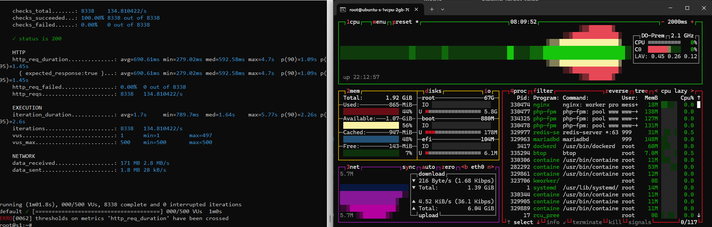
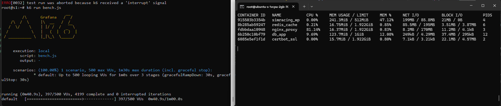

# ⚙️ Content Distribution Platform Infrastructure: Staging & Load Test Environment

**Isolated Branch for Infrastructure Validation & High-Concurrency Stress Testing**

This branch serves as a dedicated Staging and development environment to validate the new open-source infrastructure upgrade (**NGINX, Redis, PHP-FPM, Docker, and GitHub Actions CI/CD**) against our production application code before any live deployment. 

Because the platform is currently live and serving active users, a direct infrastructure migration from LiteSpeed to Docker carries high operational risks. Therefore, all technical integrations, compatibility tests, and performance benchmarks are executed here first on an isolated staging server, utilizing a containerized Certbot setup for temporary SSL verification. 

Once this native NGINX FastCGI caching architecture proves completely stable under high-concurrency stress testing, the configurations will be streamlined, stripped of the Certbot sidecar layer, and merged into the `main` branch. This ensures a clean, zero-downtime production rollout that natively leverages our existing Cloudflare SSL deployment.

The primary objectives of this branch are:

1. **Architecture Validation:** To ensure the native NGINX FastCGI caching layers operate flawlessly with the existing WordPress source code, catching any application-layer compatibility issues early.
2. **High-Concurrency Stress Testing:** To safely execute aggressive load testing (benchmarked at a peak of 500 Virtual Users via k6) on an isolated server, proving the infrastructure's stability and survival limits before production migration.


### 📊 Staging Infrastructure & Target Benchmark Specs


| Metric | Staging Target Value |
| :--- | :--- |
| **Platform** | WordPress (Custom Theme / AI-Assisted Development) |
| **Server Hardware** | **1 vCPU / 2GB RAM** DigitalOcean droplet for testing |
| **Test Host Domain** | `staging.aleix-simracing.me` |
| **Baseline Target** | **500 Max VUs (Concurrent Users)** Stress Test via k6 |
| **SSL Verification** | Let's Encrypt via containerized **Certbot Sidecar** |

---

## 🏗️ 1. System Design & Architecture Blueprint

### 1.1 Hardware Resource Hardening (2GB RAM Limit)
* **MariaDB Container:** Hard-capped at `1GB RAM` via Docker Compose deployment limits to maximize SQL buffer pool while protecting the host.
* **PHP-FPM Dynamic Pool:** Capped at `pm.max_children = 4`. Each active worker consumes ~150MB under load, safely maxing out the PHP pool at 600MB.
* **Leak Recycler (`pm.max_requests = 500`):** Automatically recycles PHP workers after 500 requests to clear runtime memory leaks.
* **Timeout Window (`max_execution_time = 3600s`):** Configured to prevent crashes during heavy migration and database sync phases, ensuring the PHP-FPM process doesn't drop during long query executions.
* **Redis Object Cache:** Deployed as an in-memory data store wrapper for the database layer to offload persistent, redundant SQL query hits from WordPress core natively.

### 1.2 Security, Network Isolation & Layered Caching
* **Public Zone (`wp_frontend`):** Only the NGINX container is connected here, exposing public ports `80/443`.
* **NGINX FastCGI Microcaching:** Configured directly at the NGINX edge layer to cache dynamic PHP pages into RAM for 1-5 minutes, intercepting high-volume traffic before they trigger PHP-FPM or MySQL execution.
* **Cache Lock Engine (`fastcgi_cache_lock on;`):** When a cache miss occurs under high concurrency, NGINX passes exactly **one** worker request to PHP-FPM to rebuild the cache file, holding back the remaining concurrent requests in a safe internal queue.
* **Background Stale Delivery (`fastcgi_cache_background_update on;`):** Delivers expired cached pages instantly to users while NGINX updates the backend cache asynchronously, dropping response latency.
* **Isolated Zone (`wp_backend` / `internal: true`):** MariaDB, Redis, and PHP-FPM containers communicate exclusively inside this private internal network, completely invisible to the public internet to block automated port scans.

### 1.3 Deployment & Data Migration
1. **Infrastructure Scaffolding:** GitHub Actions only deploys the clean infrastructure framework using official `wordpress:fpm` images.
2. **Dynamic SSL Bootstrap:** A temporary **Certbot sidecar** maps ACME challenges into `/var/www/certbot` on Port 80 to securely fetch Let's Encrypt certificates directly inside the staging server.
3. **Secrets Management:** Environment variables are injected into runtime memory via a secure `.env` file.
4. **Data Restoration:** The actual heavy production data (Database, Themes, Plugins) is restored seamlessly using the **UpdraftPlus** engine directly from the WP Admin dashboard.

---

## 📊 2. Performance Metrics & Proof of Evidence

The benchmarks below isolate the performance difference of the optimized stack when running under a 500 Max VUs load test, comparing a direct NGINX hitting baseline against an NGINX + Cloudflare Proxy architecture.

### 📉 2.1 Grafana k6 Benchmarks

> Benchmark Proofs: [Images here](./images) 🫴

#### Phase 1: Direct NGINX Origin Benchmarking (Cloudflare Proxy OFF)
When hitting the NGINX origin container directly under a 500 VU stress spike, the stack maintained a **99.96% success rate (3,154 / 3,155 requests passed)** with only 1 failed request. However, hardware constraints (1vCPU) forced a long processing queue, resulting in an elevated response latency profile:

```text
http_req_duration..............: avg=3.43s   min=282.79ms med=2.99s  max=1m0s p(95)=8.24s
http_req_failed................: 0.03%       1 out of 3155
http_reqs......................: 3155        36.739/s
```

#### Phase 2: Edge-Cached Production Benchmarking (Cloudflare Proxy ON)
After routing the traffic through the Cloudflare proxy and combining edge caching with NGINX's internal FastCGI cache locks, system throughput expanded drastically. The stack achieved a **100.00% absolute success rate (8,137 / 8,137 requests passed)**, throughput tripled to **132.21 requests/s**, and the p(95) response latency dropped sharply to **1.11 seconds**:

```text
http_req_duration..............: avg=722.4ms min=280.7ms med=681.91ms max=3.13s p(95)=1.11s
http_req_failed................: 0.00%       0 out of 8137
http_reqs......................: 8137        132.219/s
```

### 📈 2.2 Real-time Infrastructure & Protocol Validation

#### Live NGINX FastCGI Cache Verification (Curl Header)
Running a direct header check confirms that the NGINX container successfully executes micro-caching rules under the **PHP 8.4** runtime environment, securely returning `FastCGI-Cache: HIT`.

```text
HTTP/1.1 200 OK
Server: cloudflare
X-Powered-By: PHP/8.4.21
X-FastCGI-Cache: HIT
cf-cache-status: DYNAMIC
```


#### Browser Network Layer Validation (HTTP/3 and Sub-550ms Response)
Live browser network logs verify that the staging host successfully runs over the next-gen **HTTP/3 (h3)** protocol. The document request achieves a crisp **538ms response time** under load, while static assets load at **0ms via browser Memory Cache**.

```text
Domain: staging.aleix-simracing.me
Protocol: h3 (HTTP/3 over QUIC)
Document Response: 21.6 kB / 538 ms
Static Assets Overhead: 0 ms (100% Memory Cached)
```


### 💻 2.3 Staging Server Resource Telemetry (Live Load Metrics)

Telemetry data captured during the active 500 Max VUs stress test demonstrates stable resource bounding and system defense against memory exhaustion.

#### Host OS Resource Allocation (btop View)
Under peak concurrent load, the total host RAM consumption stabilizes at **855 MiB out of 1.92 GiB** (43% usage), leaving substantial headroom. CPU spikes are managed efficiently without kernel lockups or triggering the OOM killer.


#### Container Resource Constraints (docker stats View)
Strict memory limits are enforced successfully at the container isolation layer during the k6 benchmark execution:
* **`simracing_wp` (PHP-FPM):** Bounded at **241.3 MiB / 512 MiB limit** (47.12%), validating that dynamic process management configuration controls memory footprint.
* **`db_app` (MariaDB):** Hard-capped and stabilized at **123.7 MiB / 1 GiB limit** (12.37%), preserving memory structure without query-flooding the host.
* **`nginx_proxy` & `redis_cache`:** Maintain an extremely light footprint of **~16.7 MiB RAM** each, handling high-volume proxying and data store caching with near-zero runtime overhead.

```text
CONTAINER ID   NAME            CPU %     MEM USAGE / LIMIT     MEM %     NET I/O           BLOCK I/O         PIDS
915503b3354b   simracing_wp    0.00%     241.3MiB / 512MiB     47.12%    199MB / 85.8MB    21MB / 0B         4
8b285ab59247   redis_cache     0.21%     16.75MiB / 1.922GiB   0.85%     85.5MB / 195MB    3.51MB / 3.87MB   6
fdbbdaa18948   nginx_proxy     81.14%    16.37MiB / 1.922GiB   0.83%     8.2MB / 170MB     11.2MB / 4.1KB    3
6b25bc1b0f79   db_app          9.69%     123.7MiB / 1GiB       12.88%    249MB / 4.29MB    37.4MB / 295KB    12
```

